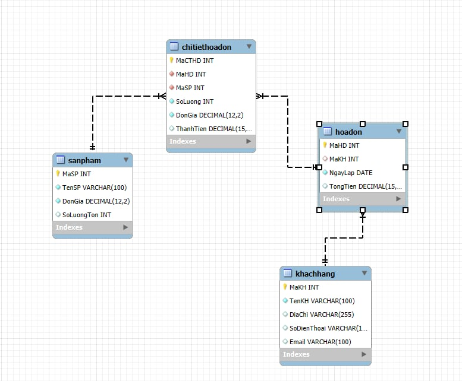
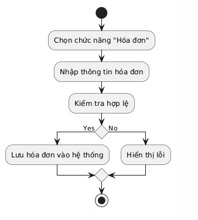
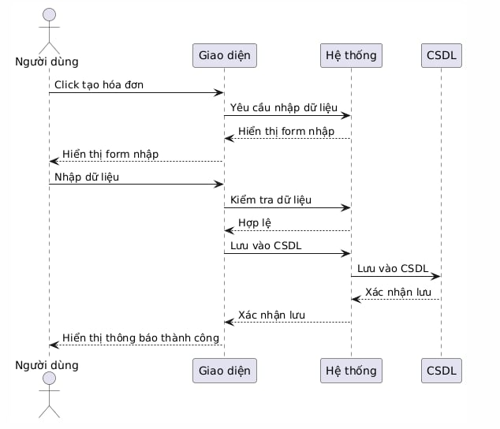

# Hệ Thống Quản Lý Bán Hàng

## Mô tả đề tài
Đây là đồ án lập trình hướng đối tượng với mục tiêu xây dựng hệ thống quản lý bán hàng. Hệ thống cho phép quản lý thông tin sản phẩm, khách hàng và hóa đơn.

## Thành viên nhóm
- **Lữ Trung Anh**
- **Phạm Gia Bách**
- **Phùng Thị Hạ Lam**

## Cấu trúc dự án
```
├── src/                    # Thư mục chứa mã nguồn
│   ├── Sanpham.java       # Class quản lý thông tin sản phẩm
│   ├── Khachhang.java     # Class quản lý thông tin khách hàng
│   ├── Hoadon.java        # Class quản lý thông tin hóa đơn
│   └── Sanphamtest.java   # Class kiểm thử cho Sanpham
├── test/                  # Thư mục chứa các test case
├── build/                 # Thư mục chứa các file biên dịch
├── nbproject/            # Cấu hình NetBeans
├── build.xml             # File cấu hình Ant build
└── manifest.mf           # File manifest cho JAR
```

## Các chức năng
1. **Quản lý Sản phẩm**
   - Thêm, sửa, xóa thông tin sản phẩm
   - Xem danh sách sản phẩm
   - Tìm kiếm sản phẩm

2. **Quản lý Khách hàng**
   - Thêm, sửa, xóa thông tin khách hàng
   - Xem danh sách khách hàng
   - Tìm kiếm khách hàng

3. **Quản lý Hóa đơn**
   - Tạo hóa đơn mới
   - Xem danh sách hóa đơn
   - Tìm kiếm hóa đơn
#### Phân tích chức năng chính: 
- Nhập thông tin khách hàng
- Nhập danh sách sản phẩm
- Tính tổng tiền + thuế + giảm giá
- Lưu hóa đơn
- In hoặc hiển thị hóa đơn

#### Phân công công việc:
- Lữ Trung Anh: Nhập thông tin khách hàng và sản phẩm
- Phạm Gia Bách: Tính tổng tiền, thuế, giảm giá
- Phùng Thị Hạ Lam: Lưu và in hóa đơn
- Cả nhóm: Gọi tất cả các phần tạo thành hàm `main()`

## Tiến độ dự án
- [x] Phân tích đối tượng (SanPham, KhachHang, HoaDon)
- [x] Viết các class chính
- [x] Viết class kiểm thử
- [x] Cập nhật tài liệu
      
#### Phân tích chức năng:
- Nhập thông tin khách hàng
- Nhập danh sách sản phẩm
- Tính tổng tiền + thuế + giảm giá
- Lưu hóa đơn
- In hoặc hiển thị hóa đơn

#### Phân công công việc:
- Lữ Trung Anh: Nhập thông tin khách hàng và sản phẩm
- Phạm Gia Bách: Tính tổng tiền, thuế, giảm giá
- Phùng Thị Hạ Lam: Lưu và in hóa đơn
- Cả nhóm: Gọi tất cả các phần tạo thành hàm `main()`
🧾 Phân công chức năng & Miêu tả phương thức
👤 Lữ Trung Anh – Nhập thông tin khách hàng và sản phẩm
Phương thức: nhapThongTinKhachHangVaSanPham()

Chức năng: Nhập tên khách hàng, SĐT, danh sách sản phẩm (tên, số lượng, đơn giá).

Trả về: Đối tượng HoaDon.

👤 Phạm Gia Bách – Tính tổng tiền, giảm giá và thuế
Phương thức: tinhTongTien(ArrayList<SanPham> danhSachSanPham)

Chức năng:

Tính tổng tiền gốc.

Giảm 5% nếu > 500.000đ.

Tính thuế VAT 10%.

Trả về: Tổng tiền cuối cùng (double).

👤 Phùng Thị Hạ Lam – Lưu và in hóa đơn
Phương thức: luuVaInHoaDon(HoaDon hoaDon, double tongTienCuoiCung)

Chức năng:

In hóa đơn ra màn hình.

Ghi hóa đơn vào file hoadon.txt.

Trả về: Không (void).

👥 Cả nhóm – Hàm main()
Gọi lần lượt các chức năng:

nhapThongTinKhachHangVaSanPham()

tinhTongTien(...)

luuVaInHoaDon(...)

Điều phối toàn bộ chương trình quản lý bán hàng.

## Nội dung 01: Xây dựng ứng dụng với yêu cầu:
Giao diện Java Spring Boot:
Ứng dụng có thể được xây dựng trên nền tảng Java Spring Boot, với các tính năng quản lý sản phẩm, khách hàng, và hóa đơn. Các yêu cầu chi tiết gồm:

## Quản lý sản phẩm:

Thêm, sửa, xóa thông tin sản phẩm.

Liệt kê danh sách sản phẩm và có thể lọc theo các tiêu chí như tên sản phẩm, loại sản phẩm, giá tiền.

## Quản lý khách hàng:

Thêm, sửa, xóa thông tin khách hàng.

Liệt kê danh sách khách hàng và có thể tìm kiếm theo các tiêu chí như tên khách hàng, địa chỉ, điện thoại.

## Quản lý hóa đơn:

Tạo hóa đơn mới cho các khách hàng đã có.

Liệt kê các hóa đơn đã tạo và có thể tìm kiếm theo các tiêu chí như ngày hóa đơn, số hóa đơn, khách hàng.

## Chức năng liên kết giữa các đối tượng:

Gán sản phẩm cho hóa đơn (sản phẩm có thể được thêm vào hóa đơn khi bán).

Dữ liệu sẽ được lưu trữ dưới dạng file nhị phân (ví dụ: sử dụng ObjectOutputStream hoặc Serializable để lưu trữ đối tượng).

## Lưu trữ dữ liệu trong bộ nhớ:

Dữ liệu sẽ được lưu trong các Collection (ArrayList, LinkedList, Map, v.v.) để quản lý các đối tượng.

Cập nhật và kiểm thử để đảm bảo rằng dữ liệu được lưu trữ đúng và dễ dàng xử lý.

## Các lớp liên quan:
SanPham: Quản lý thông tin sản phẩm (ID, tên, loại, giá, số lượng).

KhachHang: Quản lý thông tin khách hàng (ID, tên, địa chỉ, điện thoại).

HoaDon: Quản lý thông tin hóa đơn (ID hóa đơn, danh sách sản phẩm, ngày tạo, khách hàng).

### Chức năng này cho phép nhân viên thu ngân tạo hóa đơn khi khách thanh toán, lưu thông tin vào hệ thống và in ra.

## Nội dung 2

## Nội dung 3 




## Liên hệ
Nếu có thắc mắc hoặc góp ý, vui lòng liên hệ:
- Email: 23010339@st.phenikaa-uni.edu.vn 
- GitHub: https://github.com/GbachPham/OOP_N01_Term3_2025_K17_Group
